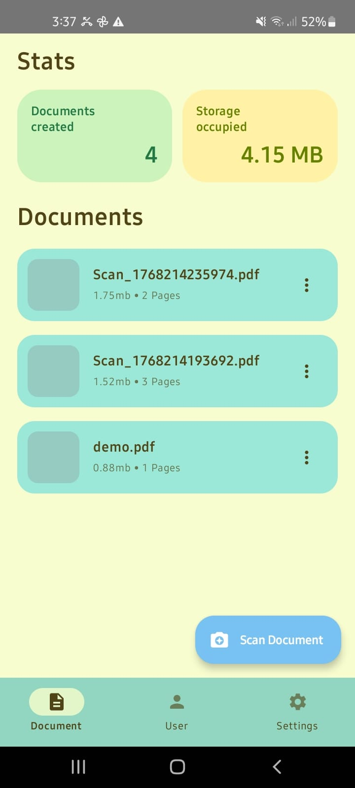
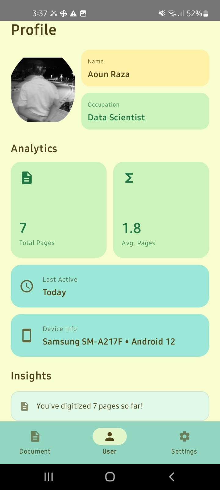
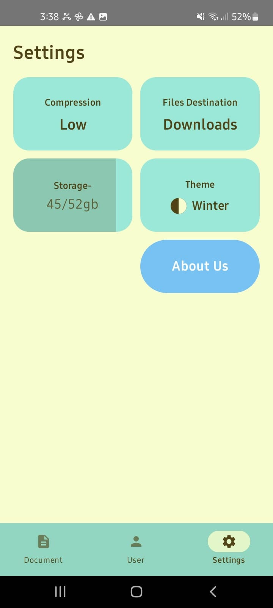

# Lumen_

<div align="center">
  <br />
  
  
  <h3 align="center">Scan. Digitise. Organize.</h3>

  <p align="center">
    A modern, intelligent Android document scanner built with Jetpack Compose.
    <br />
    <a href="#-features"><strong>Explore Features »</strong></a>
    <br />
    <br />
    <a href="#-download">Download APK</a>
    ·
    <a href="https://github.com/Aouni19/Lumen/issues">Report Bug</a>
    ·
    <a href="https://github.com/Aouni19/Lumen/issues">Request Feature</a>
  </p>
</div>

---

## 📱 About The Project

**Lumen** is more than just a camera app; it's a personal workspace for digitizing your physical world. Built entirely with **Kotlin** and **Jetpack Compose**, Lumen leverages on-device Machine Learning to detect edges, correct perspective, and generate high-quality compressed PDFs instantly.

Unlike standard scanner apps, Lumen focuses on **privacy and identity**, offering a personalized dashboard that tracks your digitization journey and storage usage.

### 📸 Screenshots

<div align="center">
  
  &nbsp;&nbsp;&nbsp;&nbsp;
  
  &nbsp;&nbsp;&nbsp;&nbsp;
  
</div>

---

## ✨ Features

* **📄 Smart Scanning:** Powered by Google ML Kit for precise edge detection and auto-cropping.
* **🗜️ Custom Compression:** Proprietary logic to compress images into PDFs without losing legibility.
* **📊 Personal Dashboard:** Visual analytics tracking total pages scanned, documents created, and storage occupied.
* **🔐 Secure Storage:** Robust `FileProvider` implementation ensuring secure file access and sharing on Android 10+.
* **🎨 Dynamic Theming:** Beautiful Material 3 UI that adapts to user preferences.
* **👤 User Identity:** Personalized onboarding flow that tailors the workspace to your profession.

---

## 🛠️ Built With

*  **Kotlin** - First-class language for Android.
*  **Jetpack Compose** - Modern toolkit for building native UI.
* **Google ML Kit** - On-device machine learning for document scanning.
* **Room Database** - Robust local data persistence.
* **DataStore** - For storing user preferences and stats.
* **Coroutines & Flow** - For asynchronous programming and reactive streams.

---

## 🚀 Getting Started

To get a local copy up and running, follow these simple steps.

### Prerequisites

* Android Studio Iguana or later.
* JDK 17.

### Installation

1.  Clone the repository
    ```sh
    git clone [https://github.com/Aouni19/Lumen.git](https://github.com/Aouni19/Lumen.git)
    ```
2.  Open the project in **Android Studio**.
3.  Sync Gradle files.
4.  Run the app on an Emulator or Physical Device (API 26+ recommended).

---

## 🤝 Contributing

Contributions are what make the open-source community such an amazing place to learn, inspire, and create. Any contributions you make are **greatly appreciated**.

1.  Fork the Project
2.  Create your Feature Branch (`git checkout -b feature/AmazingFeature`)
3.  Commit your Changes (`git commit -m 'Add some AmazingFeature'`)
4.  Push to the Branch (`git push origin feature/AmazingFeature`)
5.  Open a Pull Request

---

## 📄 License

Distributed under the MIT License. See `LICENSE` for more information.

---

## 📧 Contact

**Aoun Raza** - [LinkedIn Profile](https://www.linkedin.com/in/aoun-raza-62507826a/)

Project Link: [https://github.com/Aouni19/Lumen](https://github.com/Aouni19/Lumen)
